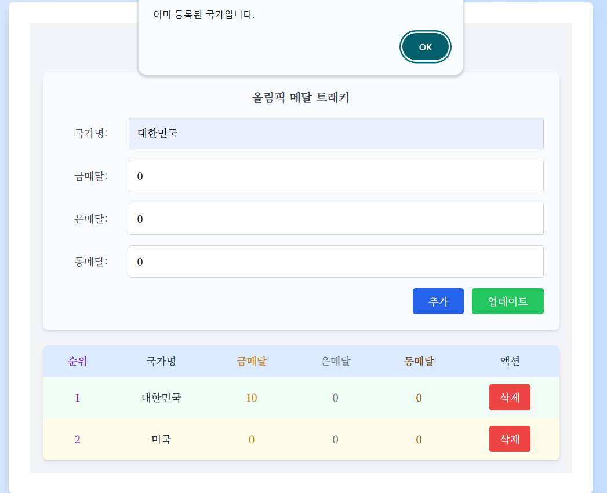

# Olympic Medal Tracker

https://dongeul24.github.io/olympic-medal-tracker/

이 웹페이지는 국가별 올림픽 메달 정보를 추가하고, 관리하는 기능을 제공합니다. 2024 파리 올림픽을 기본 테마로두고, 이 웹페이지에서 사용자는 각 국가의 메달 수를 추가, 수정 및 삭제할 수 있으며, 이 데이터는 로컬 스토리지에 저장되어 새로 고침 후에도 유지됩니다. 또한 메달 정보를 업데이트하거나 추가 시, 자동으로 올림픽 메달 순위를 계산해주고 이를 바탕으로 각 랭크 순대로 국가들을 정렬해 나타냅니다.

## 주요 기능 정리

- **국가 및 메달 수 추가**: 사용자는 국가 이름과 해당 국가의 금, 은, 동 메달 수를 입력하여 새로운 국가를 추가할 수 있습니다. 

  + 만약 이미 등록된 나라를 추가하고자 한다면, 이미 등록된 국가라고 사용자에게 알려줍니다(alert). 
  
  
  + 또한, 사용자가 국가명을 적지 않거나, 글자 없이 띄어쓰기만 되어있는 경우, 미리 정의된 유효성 검사에 의해 국가명을 입력하지 않는 한 추가되지 않습니다. (+ form 태그를 사용하여 자동으로 required 속성에 의해 유효성 검사를 해줍니다...)

  
  + 또한, 최대 입력할 수 있는 국가 이름 글자수(세계에서 가장 긴 국가명은 60자를 넘지 않음)에 대한 제한을 두었습니다. 그래서 국가명을 적는 입력창에 60자를 초과하여 입력할 수는 없습니다(maxLength). 
  
  + 마지막으로, 금,은,동메달에 음수를 입력하고 추가버튼을 눌러도 해당 국가와 그 정보를 추가할 수 없게 하였습니다. 적어도 0 이상의 수가 들어갈 수 있도록 했습니다. ( form 태그 내부에 input에 min = 0으로 설정해서이 부분도 알아서 유효성 검사 후 경고 메세지 보여줍니다....)

  
- **국가의 메달 수 수정**: 사용자는 이미 등록된 국가의 메달 수를 업데이트할 수 있습니다.

  + 만약 등록되지 않은 나라의 정보를 업데이트하고자 하면, 등록되지 않은 나라라고 사용자에게 알려줍니다.(alert)
  

- **등록된 국가 삭제**: 사용자는 목록에서 국가를 삭제할 수 있습니다.
  
  

- **로컬 스토리지 데이터 저장 및 불러오기**: 웹 페이지가 로드될 때 로컬 스토리지에서 기존 데이터를 불러오고, 사용자가 데이터를 변경할 때마다 업데이트된 데이터를 로컬 스토리지에 저장합니다.

- **메달 수에 따른 정렬 기능**: 사용자가 국가와 해당 국가의 메달 수 정보를 추가 및 업데이트할 때 메달 수를 기준으로 국가를 정렬할 수 있도록 합니다.
  + 올림픽에서 메달 순위 매기는 매커니즘: 금메달 수를 먼저 비교, 만약 같으면, 은메달 수 비교, 이마저도 같다면, 동메달 수 비교. 그리고 각 금은동 메달 수가 다 같다면, 공동 순위.
  

## 컴포넌트 설명

### 1. `App.jsx`

- **기능**: 애플리케이션의 메인 컴포넌트로, 전체 상태(state)와 로컬 스토리지 데이터를 관리합니다. 
- **주요 함수, 메서드**:
  - `useState`: `countries` 상태 변수를 사용하여 등록된 국가 목록을 관리합니다. 초기값은 로컬 스토리지에 저장된 데이터를 기반으로 생상됩니다. 만약, 로컬 스토리지에 데이터가 없다면, 빈 배열로 설정됩니다.
  - `useEffect`:
    - 첫 번째 `useEffect`는 로컬 스토리지에서 저장된 국가 목록을 불러와서 `countries` 상태를 업데이트합니다.
    - 두 번째 `useEffect`는 `countries` 상태가 변경될 때마다 로컬 스토리지에 현재 국가 목록을 저장합니다.
  - `addCountry`: 새로운 국가 정보를 받아 현재 국가 목록에 추가합니다. 중복된 국가가 있을 경우 경고를 표시합니다.
  - `updateCountry`: 수정된 국가 정보를 기반으로 해당 국가의 정보를 업데이트합니다. 등록되지 않은 국가를 수정하려고 할 경우 경고를 표시합니다.
  - `deleteCountry`: 주어진 국가 이름에 해당하는 국가를 목록에서 삭제합니다.

### 2. `MedalForm.jsx`

- **기능**: 사용자가 국가와 메달 수를 입력할 수 있는 폼을 제공합니다. 사용자는 이 폼을 통해 국가를 추가하거나 수정할 수 있습니다.
- **주요 함수, 메서드**:
  - `useState`: 각 입력 필드(국가 이름, 금, 은, 동 메달 수)의 상태를 관리합니다.
  - `handleSubmit`: 사용자가 폼을 제출할 때 호출되며, 입력된 정보를 기반으로 새로운 국가를 추가하거나 기존 국가의 정보를 수정합니다. 제출 후 입력 필드를 초기화합니다.
    + `onClick={handleUpdate}`를 사용해서 업데이트 기능도 다룹니다. 
  - `resetForm()` : 업데이트 및 추가 시 입력창 내용을 초기화 시켜줍니다.

### 3. `MedalList.jsx`

- **기능**: 등록된 국가 목록을 표시하는 컴포넌트로, 각 국가 정보를 순위별로 나타냅니다. `MedalItem` 컴포넌트를 사용하여 국가별 정보를 렌더링합니다.
- **주요 함수, 메서드**:
  - `map`: `countries` 배열을 반복하여 각 국가에 대한 `MedalItem` 컴포넌트를 생성하고 렌더링합니다. 이를 통해 동적으로 목록이 생성시킵니다.
  - `sort`: 메달 수를 기반으로 순위를 매기기 위해 금메달 수, 은메달 수, 동메달 수를 기반으로 정렬합니다.
    + 만약, 두 국가가 금은동 메달 수가 다 같다면 공동 순위를 부여하고, 그 다음 국가의 rank는 공동 순위에 오른 국가 수만큼 뒤로 밀려납니다.

### 4. `MedalItem.jsx`

- **기능**: 개별 국가의 정보를 표시하는 컴포넌트로, 국가 이름, 금, 은, 동 메달 수를 나타내고, 삭제 및 편집 기능을 제공합니다.
- **주요 메서드**:
  - `deleteCountry`: 삭제 버튼 클릭 시 해당 국가를 목록에서 삭제합니다. 삭제 시 삭제했다는 메세지를 표시해(alert) 사용자가 삭제했음을 알 수 있게 도와줍니다.

## Tailwind CSS 사용

이 프로젝트에서는 **Tailwind CSS**를 사용하여 스타일링을 구현하였습니다. 

+ 예시: 이런식으로 미리 만들어져있는 스타일적 요소들을 inline 형식으로 태그 내부에 넣어 사용했습니다.

- **Flexbox**: `flex`, `justify-center`, `items-center` 등의 클래스를 사용하여 레이아웃 정렬 및 위치 조정.
- **Spacing**: `p-5`, `mb-5`, `max-w-4xl` 등의 클래스를 사용하여 요소 간의 여백 및 최대 너비 설정.
- **Typography**: `text-3xl`, `font-bold`, `text-gray-700` 등을 사용하여 텍스트 스타일링과 색상 설정.
- **Backgrounds**: `bg-gray-100`, `bg-white`, `hover:bg-gray-200` 등의 클래스를 사용하여 요소의 배경 색상과 호버 효과 설정.

 + 더욱 신중하게 고려했던 스타일 요소: 테이블 형식으로 국가 정보가 추가되어 표시되는데, 각 테이블 행을 볼때 그 요소가 홀수번째 줄 일때, 짝수번째 줄 일때 다른 색을 주어서 사용자가 보기에 조금 더 편하게 만들었습니다.
  - `even`, `odd` 사용  
  

 + 그리고 마우스를 버튼에 올려두면 그 색이 변하게, 즉, 사용자가 버튼을 클릭할 때의 user experience를 향상시키기 위해 `hover`를 사용했습니다.